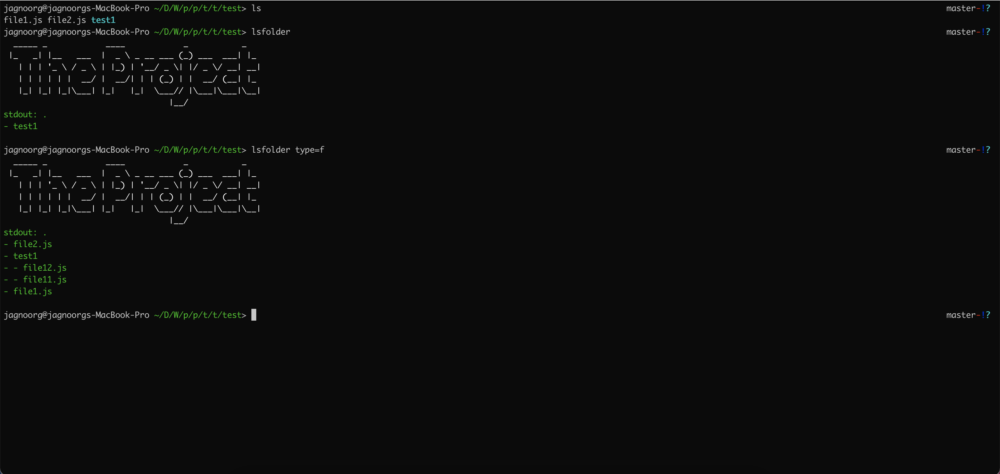

Inspired by the `ls` bash command, `the command line project` is a recursive directory/file listing program that produces a depth indented listing of folders/files in your system

# Install

```
npm i lsfolder -g
```

# Usage

Using your terminal `cd` into the folder of your choice.

To view a recursive `list` of `directories` in the folder, run:

```
lsfolder type=d
```

OR

```
lsfolder

```

You'll see something like this:



The image shows what you'll see when you run different lsfolder commands and how they compare to the good old beloved `ls`

To view a recursive `list` of `directories` and `files` in the folder, run:

```
lsfolder type=f
```

Note: if you don't specify a `type` command, program defaults to listing all directories recursively. Files will not be listed. Type `d` is for directories and `f` is for directories and files.

<center> << Made with ♥ by Jagnoor Grewal >>  </center>
